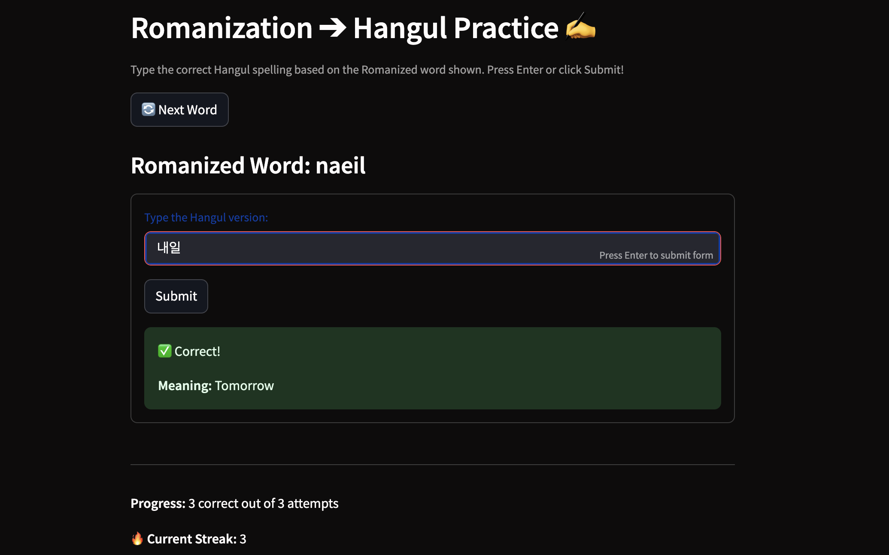

# 🇰🇷 Learn Korean: Mini Games Hub 🎮

Welcome to the **Learn Korean Mini Games Hub**, an interactive web-based platform that helps beginner Korean learners improve their language skills through a variety of fun and focused mini-games.

This project was created as part of my final assignment for *Elements of Computing II*. I built it because I found it surprisingly difficult to find Korean learning apps that combine multiple game modes in one place. Most apps only focus on flashcards or grammar — so I set out to build something better.

---

## 📌 Features

The app is designed with a clean multi-tab layout and includes four engaging mini-games:

| Game | Description |
|------|-------------|
| ✍️ **Romanization ➔ Hangul** | Practice typing correct Hangul based on the Romanized Korean word. Tracks progress and streaks. |
| 📝 **Vocabulary Quiz** | Pick the correct Korean word for a given English prompt from multiple choices. Fully randomized. |
| 🏎️ **Korean TypeRacer** | Choose between Easy or Hard difficulty and test your typing speed in Korean. Tracks best times. |
| ⏳ **Tense Selector** | Choose the correct Korean verb tense (past, present, future) based on the English sentence. Includes grammar sidebar guide. |

Each game is self-contained and allows you to reset for a new challenge at any time. Feedback, streaks, and total correct/attempts are tracked per game.

---

## 💻 Technologies Used

- **Python 3.10+**
- [**Streamlit**](https://streamlit.io/) — for building the interactive web app
- Custom layout and styling using `st.markdown()` with inline CSS

---

## 🚀 Running the App Locally

Make sure Python and pip are installed, then:

```bash
# Clone the repo
git clone https://github.com/GooboGobbo/StreamlitAppFinal.git
cd StreamlitAppFinal

# Install dependencies
pip install -r requirements.txt

# Run the app
streamlit run app.py
```

## 🌐 Deployment

This app can be deployed for free using [**Streamlit Community Cloud**](https://hangulpractice.streamlit.app/).  

---

## 📚 Learning Resources Included

The app includes grammar help and references for:

- ✅ **Korean verb tense explanations** in the **Tense Selector** tab sidebar  
- ✅ **Romanization tips** and **Hangul block explanations** in the **Romanization** game sidebar  
- ✅ **Vocabulary matched** with beginner-friendly terms and practical expressions  

---

## 📸 Visual Examples
Below are some screenshots of the minigames in action. The first image is of Romanization -> Hangul, 
the second being Typeracer

## Raw Data


## Bar Chart Visualization


---

## ✨ About the Author

**James Edge**  
University of Notre Dame  
Final project for *Elements of Computing II*

> “I built this app to combine my passion for learning Korean and my background in programming.  
> I wanted to make something fun, useful, and educational — and something I wish I had when I started learning Hangul.”
